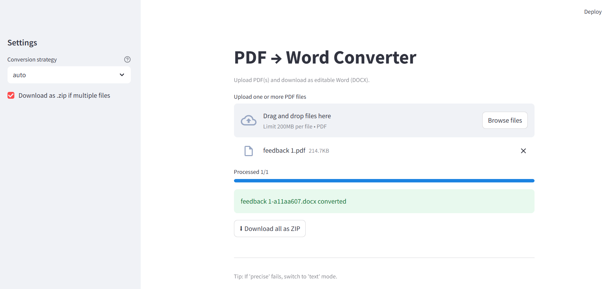

# PDF → Word Converter – Streamlit-based Document Toolkit
PDF → Word Converter is a simple yet powerful web application built with **Streamlit**.  
It allows users to upload PDF files and convert them into editable Word documents (.docx) directly in the browser.


  
<br/>
<i>Sample </i>

---

## Table of Contents

1. [Project Overview](#-project-overview)  
2. [Features](#-features)  
3. [Project Structure](#-project-structure)  
4. [Use Cases](#-use-cases)  
5. [Tech Stack](#-tech-stack)  
6. [Installation](#-installation)  
7. [Feature Details](#-feature-details)  
8. [How It Works](#-how-it-works)  
9. [Known Issues](#-known-issues)  
10. [Future Enhancements](#-future-enhancements)  
11. [License](#-license)  
12. [Contributing](#-contributing)  
13. [Contact](#-contact)  

---

## Project Overview

### 1. This app is designed to:
- Upload PDF files up to **200MB**.  
- Convert PDF pages into **.docx Word files**.  
- Provide real-time feedback in a user-friendly Streamlit interface.  
- Support both **single file conversion** and **multiple files** (zipped).  

### 2. Why this project?
- Many existing PDF-to-Word tools are paid or limit free usage.  
- This is a lightweight, open-source alternative for **students, office workers, and researchers**.  

---

## Features

| Feature Name              | Description                                      | Library Used |
|----------------------------|--------------------------------------------------|--------------|
| **Single File Conversion** | Upload and convert a PDF into `.docx`.           | `pdf2docx`, `python-docx` |
| **Batch Conversion**       | Convert multiple PDFs and download as `.zip`.    | `zipfile`, `io.BytesIO` |
| **Clean UI**               | Simple drag-and-drop interface powered by Streamlit. | `streamlit` |
| **Safe Filenames**         | Auto-generate filenames with hash + timestamp.   | `hashlib`, `time` |

---

## Project Structure
```
├── converter/
│ └── pdf_to_docx.py # Conversion logic
├── utils/
│ └── file_ops.py # File handling utilities (safe names, timestamp, etc.)
├── streamlitApp.py # Main Streamlit app
├── requirements.txt # Python dependencies
├── demo.png demo screenshots
├── LICENSE
└── README.md

```

---

## Use Cases

| Use Case                  | Description |
|----------------------------|-------------|
| **Students**              | Convert lecture notes in PDF into editable Word for annotation. |
| **Office Work**           | Edit reports/contracts that are only available in PDF. |
| **Batch Processing**      | Convert multiple academic papers at once into `.docx`. |
| **Educational Tool**      | Demonstrate PDF parsing & document processing with Python. |

---

## Tech Stack

| Purpose            | Libraries Used |
|--------------------|----------------|
| **PDF Parsing**    | `pdf2docx` |
| **Word Creation**  | `python-docx` |
| **UI/Frontend**    | `streamlit` |
| **Helpers**        | `hashlib`, `time`, `io`, `zipfile` |

---

## Installation

### 1. Clone the repository:
```bash
git clone https://github.com/paht2005/PDF_to_Word_Converter.git
cd PDF_to_Word_Converter
```

### 2. Install dependencies:
```bash
pip install -r requirements.txt
```

### 3. Run the app:
```bash
streamlit run streamlitApp.py
```
Open your browser at: ``http://localhost:8501``

---

## Feature Details
### 1. File Upload
- Drag and drop multiple PDF files.
- Each file is validated for size (≤200MB).

### 2. Conversion Logic
For each PDF:
- Parse with `pdf2docx.Converter`.
- Create Word document using `python-docx`.
- Save with **unique name** (`filename-<hash>-<timestamp>.docx`).

### 3. Batch Mode
- If multiple files uploaded, results are zipped automatically.
- Users can download .zip containing all .docx outputs.

--- 
## How It Works
```bash
Input PDF → pdf2docx → Extract text/images → Write into .docx → Safe filename → Download
```
- **Single file:** Direct `.docx` download.
- **Multiple files:** Auto-zip packaging.

---
## Known Issues
| Issue                | Reason                             | Fix                         |
| -------------------- | ---------------------------------- | --------------------------- |
| **Complex layouts**  | Tables/images may not convert 100% | Manual adjustment in Word   |
| **Large files slow** | Conversion speed depends on #pages | Show progress bar in future |
| **Fonts mismatch**   | PDF fonts may not exist in Word    | Edit styles manually        |

--- 
## Future Enhancements
- Add cloud storage integration (Google Drive/Dropbox).
- Support scanned PDFs → OCR → Word with pytesseract.
- Add progress bar in Streamlit for long files.
- Support DOCX → PDF reverse conversion.
---
## LICENSE
This project is licensed under the MIT License.
See the [LICENSE](./LICENSE) file for details.

--- 
## Contributing
Contributions are welcome!
Fork, create a pull request, or open an issue .

--- 
## Contact
Contact for work: Nguyễn Công Phát – congphatnguyen.work@gmail.com
